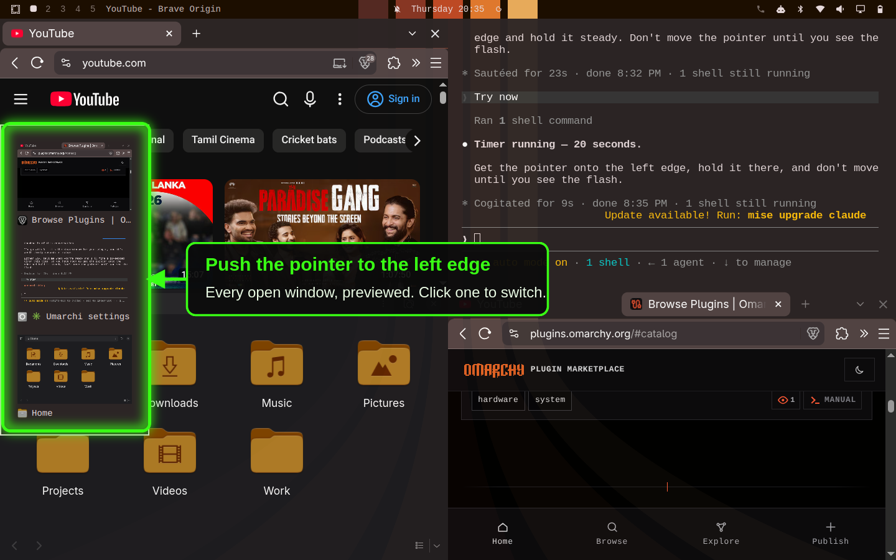

# Stage Drawer

A Stage Manager-style window switcher for the [Omarchy](https://omarchy.org/) shell.



## What it does

Push the pointer against the **left edge of the screen**. A drawer slides in
showing a preview of every open window. Click one to switch to it.

That's the whole idea. In detail:

- **It shows every window**, across all workspaces — including ones hidden by
  `show-desktop`, which are otherwise hard to get back to.
- **Clicking a window switches to it and makes it full width.** If you were
  already in fullscreen, it opens fullscreen instead, so your mode is preserved.
- **A "Back to tiles" button** returns everything on the workspace to the normal
  tiled layout.
- **It works on top of full-width and fullscreen windows**, so you can get out of
  a maximized app without reaching for a keybinding.

## Install

```bash
omarchy plugin add https://github.com/sumanthmukkala/omarchy-stage-drawer --enable
```

That is all — no config file to edit, no keybinding to set. Move the pointer to
the left edge and it works.

**Update:**

```bash
omarchy plugin update io.github.sumanthmukkala.stage-drawer
```

**Uninstall:**

```bash
omarchy plugin remove io.github.sumanthmukkala.stage-drawer
```

## Requirements

| | |
| --- | --- |
| Omarchy | 4.x (Quattro), with `omarchy-shell` |
| Compositor | Hyprland |
| Commands | `hyprctl`, `jq` — both ship with Omarchy |

No other dependencies. Nothing is downloaded at runtime.

## Settings

There is no config file. To change how it feels, edit the constants at the top of
`Drawer.qml`:

| Property | Default | What it controls |
| --- | --- | --- |
| `drawerWidth` | `240` | Width of the drawer, in pixels |
| `edgeWidth` | `2` | How many pixels of screen edge trigger it |
| `edgeBottomGap` | `80` | Dead zone at the bottom, so it doesn't fight a hot corner |
| `openDelayMs` | `120` | How long you must hover before it opens |
| `closeDelayMs` | `300` | Grace period before it closes again |

Changes apply the moment you save. No restart.

## Performance

Written for an older Intel MacBook Air, so it avoids the expensive parts of this
kind of overlay:

- The edge trigger is **event-driven**, not a timer polling the cursor position.
- Each preview is **one still frame**, captured when the drawer opens, rather
  than a live-updating thumbnail.
- Previews are **destroyed when the drawer closes**, so nothing is held in memory
  while it sits idle.

## Theming

It reads `Color` and `Style` from `qs.Commons`, so it follows whatever Omarchy
theme is active. Nothing to configure.

## How it works

Two files:

- **`Drawer.qml`** — the interface: the edge trigger, the slide animation, and
  the window previews.
- **`stage-switch`** — a small bash helper. Hyprland window management happens
  through `hyprctl`, so focus changes, fullscreen state, and recovering windows
  from special workspaces are done here.

The plugin writes no configuration files. It only queries and dispatches through
`hyprctl`, which changes live window state, not anything on disk.

## License

MIT — see [LICENSE](LICENSE).
